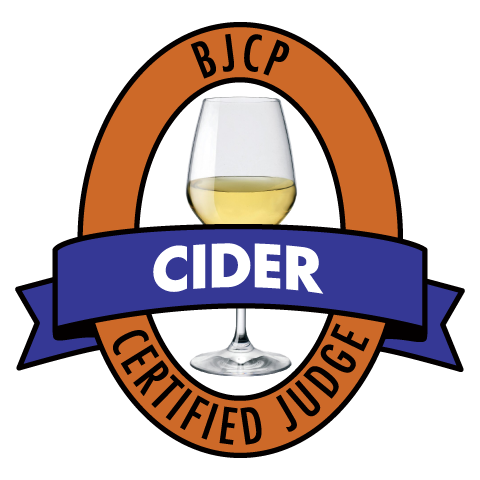

# Beer Judge Certification Program

# 2015 Style Guidelines

## Cider Style Guidelines

### Copyright © 2015, BJCP, Inc.

**The BJCP grants the right to make copies for use in BJCP-sanctioned competitions or for educational/judge training purposes.**

*All other rights reserved.*

Updates available at **www.bjcp.org.**

Edited by Gordon Strong with Kristen England

**Content:**                   Dick Dunn (lead), Gary Awdey, Charles McGonegal

**Review and Commentary:**    Andrew Lea, Nick Bradstock, Rich Anderson, Lee McAlpine, Claude Jolicoeur, Rex Halfpenny

**Final Review:**             Dennis Mitchell, Agatha Feltus, Michael Wilcox, Brian Eichhorn

# Introduction to Cider Guidelines (Categories C1-C2)

The following discussion applies to all the cider styles, except where explicitly superseded in the sub-category guidelines. This introduction identifies common characteristics and descriptions for all types of cider, and should be used as a reference whenever entering or judging cider.

**Cider** is fermented apple juice. **Perry** is fermented pear juice. There are two categories for cider and perry: Standard Cider and Perry (Category C1) and Specialty Cider and Perry (Category C2). The Standard category covers ciders and perries made primarily or entirely from the juice of apples or pears (but not both at once). The only adjunct permitted in the Standard category, and only in some sub-categories, is a limited addition of sugar to achieve a suitable starting gravity or to raise sweetness post-fermentation. Note that honey is not a "sugar" for this purpose; a cider made with added honey must be entered either as a Specialty cider or as a Cyser under the appropriate mead sub-category. Other sugar sources that also add significant flavors (brown sugar, molasses) would also create a Specialty cider (such as New England style).

## Aroma and Flavor 

-   Ciders and perries do not necessarily present overtly fruity aromas or flavors - in the same sense that a wine does not taste overtly of grapes. Drier styles of cider in particular develop more complex but less fruity characters. A simple *apple soda* or *wine cooler* character is not desirable in a cider or perry.

-   Some styles of cider exhibit distinctly **non-**fruity tastes or aromas, such as the *smoky ham* undertones of a dry English cider.

-   The ***sweetness*** (residual sugar, or RS) of a cider or perry may vary from absolutely dry (no RS) to as much as a sweet dessert wine (10% or more RS). In sweeter ciders, other components of taste - particularly acidity - must balance the sweetness. The level of sweetness must be specified so organizers and judges can arrange flights of tastings and entries within flights. Tasting should always proceed from drier to sweeter. There are five categories of sweetness, expanded from three in earlier guidelines. Note that the numbers for these levels are **not** rigid or restrictive. They are intended to guide the cidermaker on how to enter, not to be used as judging criteria unless a cider is declared at a sweetness level far from its actual sweetness. Judges must realize that sweetness can mask faults. Be more attentive to this in a sweeter cider. Likewise, do not penalize dry ciders excessively for minor faults which may be more evident only because of lack of sweetness. The categories and *approximate* sugar levels are as follows. Final gravities are particularly rough numbers since they cannot take account of what the SG would be if the cider fermented out completely.

    -   **Dry:** below 0.4% residual sugar. This corresponds to a final specific gravity less than 1.002. There is no perception of sweetness.

    -   **Medium-dry:** 0.4-0.9% residual sugar. This corresponds to a final specific gravity of 1.002-1.004. There is a hint of sweetness but the cider is still perceived primarily as dry. Also known as semi-dry.

    -   **Medium:** in the range between dry and sweet, 0.9-2.0% residual sugar, final gravity 1.004-1.009. Sweetness is now a notable component of the overall character.

    -   **Medium-sweet:** 2.0-4.0% residual sugar, final gravity 1.009-1.019. The cider is sweet but still refreshing. Also known as semi-sweet.

    -   **Sweet:** above 4.0% residual sugar, roughly equivalent to a final gravity of over 1.019. The cider has the character of a dessert wine. It must not be cloying; see notes on balance.

-   If a cider is close to one of these boundaries, it should be identified by the sweetness category which best describes the overall impression it gives. The five categories above were expanded from the earlier three dry-medium-sweet by splitting the dry and medium categories.

-   ***Acidity*** is an essential element of cider and perry: it must be sufficient to give a clean, refreshing impression without being puckering. Acidity (from malic and in some cases lactic acids) must not be confused with acetification (from ethyl acetate or acetic acid - vinegar). The acrid aroma and tingling taste of acetification is a fault.

-   Ciders and perries vary considerably in ***tannin***. This affects both bitterness and astringency (see *Mouthfeel* below). If made from culinary or table fruit, tannins are typically low; nevertheless some tannin is desirable to balance the character. The character contributed by tannin should be mainly astringency rather than bitterness. An overt or forward bitterness is a fault, and is often due to processing techniques rather than fruit character.

-   Cider may go through a ***malo-lactic fermentation*** (MLF) which converts some or all of the sharp malic acid to softer, less-acidic lactic acid. (Perries should not go through MLF because it will cause undesirable acetification.) In ciders made with tannic apples, the MLF commonly produces ethylphenols which are evident as other flavors: spicy/smoky including smoked meat, phenolic, and farmyard/old-horse. These flavors are desirable although not mandatory in English and French styles, but must not be *over the top*. The spicy-smoky character is the most desirable of the three. Note that a dominating farmyard character may be the result of a Brettanomyces contamination rather than MLF; this is a serious fault. Also, because MLF reduces the acidity of a cider, the result should not be *flabby* or too soft; the cider must remain refreshing. Finally, judges should be attentive to the possibility of faults such as mousiness which are more likely in a higher pH cider that has gone through MLF. (Some judges may be unable to detect *mouse*; an alkaline oral rinse may be needed to confirm and reach agreement among judges.)

## Appearance

-   Clarity may vary from good to brilliant. The lack of sparkling clarity is not a fault, but visible particles are undesirable. In some styles a "rustic" lack of brilliance is common. Perries are notoriously difficult to clear; as a result a slight haze is not a fault. However, a "sheen" in either cider or perry generally indicates the early stage of lactic contamination and is a distinct fault.

-   Carbonation may vary from entirely still to a champagne level. No or little carbonation is termed **still**. A still cider may give a slight *tickle on the tongue*. A moderate carbonation level is termed **petillant**. Highly carbonated is termed **sparkling**. At the higher levels of carbonation, the *mousse* (head) may be retained for a short time. However, gushing, foaming, and difficult-to-manage heads are faults.

## Mouthfeel

-   In general, cider and perry have a body and fullness akin to a light wine. The body is much less than that of beer. Mouthfeel depends on tannin level. Tannic styles (English and French) will have astringent mouthfeel resembling a red wine. Full-sparkling ciders will be champagne-like.

## Ingredients

-   The apple and pear varieties are intended to illustrate commonly used examples, not dictate requirements when making the style. In general, adjuncts and additives are prohibited except where specifically allowed in particular styles, and then the entrant must state them. Common processing aids, and enzymes, are generally allowed as long as they are not detectable in the finished cider. Yeast used for cider/perry may be either *natural* (the yeast which occurs on the fruit itself and/or is retained in the milling and pressing equipment) or *cultured* yeast. Malo-lactic fermentation is allowed, either naturally occurring or with an added ML culture. Enzymes may be used for clarification of the juice prior to fermentation. Malic acid may be added to a low-acid juice to bring acidity up to a level considered safe for avoiding bacterial contamination and off-flavors (typically pH 3.8 or below). Sulfites may be added as needed for microbiological control. If used, the maximum accepted safe level for sulfites (200 mg/l) must be strictly observed; moreover, any excess sulfite that is detectable in the finished cider (a "burning match" character) is a serious fault.

-   If a cider is to have sweetness (residual sugar), this may be obtained by arresting fermentation or back-sweetening with sugar or fresh juice. In this case, entrant must ensure that the cider is stable. Turbidity, gushing, or foaming resulting from restarted fermentation in-bottle are considered serious faults.

-   If the cider is fermented and/or aged with wood (barrel, chips, staves/strips), the type of wood and process must be declared. Except for category C2F (Specialty Cider/Perry), the wood character must be no more than barely recognizable. A cider with substantial wood/barrel character entered in any category other than C2F will be regarded as not in the style.

-   Sorbate may be added at bottling to stabilize the cider. However, any residual aroma/flavor from excessive use or misuse of sorbate (e.g., a *geranium* note) is a distinct fault.

-   Carbonation may be either natural (by maintaining CO~2~ pressure through processing or by bottle-conditioning) or added (by CO~2~ injection). In most categories, a still (completely uncarbonated) cider is appropriate. Judges must realize that carbonation can improve a naive impression of a cider and must not penalize still ciders (when declared properly) for lack of carbonation.

# C1. Standard Cider and Perry

The styles represented in this category are the principal established styles. "New World" is simply a name change from the "Common" of earlier versions.

There are known styles not represented here. In particular, Spanish (Asturian and Basque) does not yet have a style definition because there is presently insufficient appreciation and understanding, as well as a lack of commercial examples of known quality for reference.

In the case of a cider made to a style not explicitly represented here, it should be entered in the closest applicable category. The first decision is whether the cider was made with apples with significant tannin content that gives the cider noticeable astringency or bitterness. If not, it should be entered as a New World Cider. If so, the choice is between the English and French sub-categories; this decision should be based on whether the cider tends more toward sweet, rich, somewhat fruity (French) or drier and more austere (English). For perry of a non-represented style, the decision is, as above, based on tannin content. If in doubt, enter as New World Perry.

## C1A. New World Cider 

A **New World Cider** is made from culinary/table apples, with wild or crab apples often used for acidity/tannin balance. Compared to other styles in this category, these ciders are generally relatively lower in tannin and higher in acidity. "New World" references the style, not a location, as ciders in this style are also made in eastern England, Australia, Germany, etc.

**Overall Impression:** A refreshing drink of some substance - not bland or watery. Sweet ciders must not be cloying. Dry ciders must not be too austere.

**Aroma/Flavor:** Sweet or low-alcohol ciders may have apple aroma and flavor. Dry ciders will be more wine-like with some esters. Sugar and acidity should combine to give a refreshing character. Acidity is medium to high, refreshing, but must not be harsh or biting.

**Appearance:** Clear to brilliant, pale to medium gold in color.

**Mouthfeel:** Medium body. Some tannin should be present for slight to moderate astringency, but little bitterness.

**Comments:** An ideal cider serves well as a "session" drink, and suitably accompanies a wide variety of food.

**Entry Instructions:** Entrants **MUST** specify carbonation level (3 levels). Entrants **MUST** specify sweetness (5 categories). If OG is substantially above typical range, entrant should explain, e.g., particular variety of apple giving high-gravity juice.

**Varieties:** Common (Winesap, Macintosh, Golden Delicious, Braeburn, Jonathan), multi-use (Northern Spy, Russets, Baldwin), crabapples, any suitable wildings.

**Vital Statistics:** 

    OG: 1.045 - 1.065
    FG: 0.995 - 1.020
    ABV: 5 - 8%

**Commercial Examples:** \[US\] Uncle John's Fruit House Winery Apple Hard Cider, Tandem Ciders Pretty Penny (MI), Bellwether Spyglass (NY), West County Pippin (MA), White Winter Hard Apple Cider (WI), Wandering Aengus Ciderworks Bloom (OR), Æppeltreow Appely Brut and Doux (WI).

## C1B. English Cider 

**English Cider** includes the English "West Country" plus ciders inspired by that style. These ciders are made with bittersweet and bitter-sharp apple varieties cultivated specifically for cider making. English ciders are traditionally fermented and aged in wood barrels, which adds some character; however, the barrels used are rarely new, so there is no overt wood character.

**Overall Impression:** Generally dry, full-bodied, austere. Complex flavor profile, long finish.

**Aroma/Flavor:** No overt apple character, but various flavors and esters that suggest apples, particularly tannic varieties. English-style ciders commonly go through MLF (see *Introduction/Aroma-and-Flavor*) which produces desirable spicy/smoky, phenolic, and farmyard/old-horse characters. These flavor notes are positive but **not** required. If present, they must not dominate; in particular, the phenolic and farmyard notes should not be heavy. A strong farmyard character without spicy/smoky or phenolic suggests a *Brettanomyces* contamination, which is a fault. Mousiness is a serious fault.

**Appearance:** Barely cloudy to brilliant. Medium yellow to amber color.

**Mouthfeel:** Full. Moderate to high tannin, perceived as astringency and some bitterness. Carbonation still to moderate. Bottle-fermented or -conditioned ciders may have high carbonation, up to champagne levels, but not gushing or foaming.

**Comments:** Sweet examples exist, but dry is most traditional, particularly when considering the drying contributions of tannin.

**Entry Instructions:** Entrants **MUST** specify carbonation level (3 levels). Entrants **MUST** specify sweetness (dry through medium-sweet, 4 levels). Entrants **MAY** specify variety of apple for a single varietal cider; if specified, varietal character will be expected.

**Varieties:** Kingston Black, Stoke Red, Dabinett, Porter's Perfection, Nehou, Yarlington Mill, Major, various Jerseys, etc.

**Vital Statistics:** 

    OG: 1.050 - 1.075
    FG: 0.995 - 1.015
    ABV: 6 - 9%

**Commercial Examples:** \[US\] Westcott Bay Traditional Very Dry, Dry and Medium Sweet (WA), Farnum Hill Extra-Dry, Dry, and Farmhouse (NH), Wandering Aengus Oaked Dry (OR), Montana CiderWorks North Fork (MT), Bellwether Heritage (NY).

\[UK\] Oliver's Traditional Dry, Hogan's Dry and Medium Dry, Henney's Dry and Vintage Still, Burrow Hill Medium, Aspall English Imperial.

## C1C. French Cider

**French Cider** includes Normandy styles plus ciders inspired by those styles, including ciders made by various techniques to achieve the French flavor profile. These ciders are made with bittersweet and bitter-sharp apple varieties cultivated specifically for cider making.

Traditional French procedures use small amounts of salt and calcium compounds (calcium chloride, calcium carbonate) to aid the process of pectin coagulation. These compounds may be used, pre-fermentation, but in limited quantity. It is a fault if judges can detect a salty or chalky taste. The enzyme PME (pectin methyl esterase) may also be used pre-fermentation for pectin coagulation.

Note that the sweetness/gravity levels indicate an overall tendency, not a sharp delineation between English and French ciders.

**Overall Impression:** Medium to sweet, full-bodied, rich.

**Aroma/Flavor:** Fruity character/aroma. This may come from slow or arrested fermentation (in the French technique of *défécation*) or approximated by back-sweetening with juice. Tends to a rich fullness. MLF notes of spicy-smoky, phenolic, and farmyard are common but not required (just as with English style), and must not be pronounced. The French expect more subtle MLF character than do the English.

**Appearance:** Clear to brilliant, medium yellow to amber color.

**Mouthfeel:** Medium to full, mouth-filling. Moderate tannin, perceived mainly as astringency. Carbonation moderate to champagne-like, but at higher levels it must not gush or foam.

**Comments:** Typically made sweet to balance the tannin levels from the traditional apple varieties.

**Entry Instructions:** Entrants MUST specify carbonation level (3 levels). Entrants MUST specify sweetness (medium to sweet only, 3 levels). Entrants MAY specify variety of apple for a single varietal cider; if specified, varietal character will be expected.

**Varieties:** Nehou, Muscadet de Dieppe, Reine des Pommes, Michelin, etc.

**Vital Statistics:** 

    OG: 1.050 - 1.065
    FG: 1.010 - 1.020
    ABV: 3 - 6%

**Commercial Examples:** \[US\] West County Reine de Pomme (MA), \[France\] Eric Bordelet (various), Etienne Dupont, Etienne Dupont Organic, Bellot

## C1D. New World Perry 

**New World Perry** is made from culinary/table pears.

**Overall Impression:** Mild. Medium to medium-sweet. Still to lightly sparkling. Only very slight acetification is acceptable. Mousiness, ropy/oily characters are serious faults.

**Aroma/Flavor:** There is a pear character, but not obviously fruity. It tends toward that of a young white wine. No bitterness.

**Appearance:** Slightly cloudy to clear. Generally quite pale.

**Mouthfeel:** Relatively full, low to moderate tannin apparent as astringency.

**Comments:** *Some* table pears may contain significant amounts of sorbitol, in which case a *dry* perry may give an impression of sweetness due to sorbitol in the pears. Perception of sorbitol as *sweet* is highly variable from one person to the next. Hence, entrants should specify sweetness according to actual residual sugar amount, and judges must be aware that they might perceive more sweetness than how the perry was entered.

**Entry Instructions:** Entrants **MUST** specify carbonation level (3 levels). Entrants **MUST** specify sweetness (5 categories).

**Varieties:** Bartlett, Kiefer, Comice, Conference, etc.

**Vital Statistics:** 

    OG: 1.050 - 1.060
    FG: 1.000 - 1.020
    ABV: 5 - 7%

**Commercial Examples:** \[US\] White Winter Paarynat (WI), Uncle John's Fruit House Winery Perry (MI)

## C1E. Traditional Perry 

Traditional perry is made from pears grown specifically for that purpose rather than for eating or cooking. Many "perry pears" are nearly inedible due to high tannins; some are also quite hard. Perry pears may contain substantial amounts of sorbitol, a non-fermentable sweet-tasting compound. Hence a perry can be completely dry (no residual sugar) yet taste sweet.

**Overall Impression:** Tannic. Medium to medium-sweet. Still to lightly sparkling. Only very slight acetification is acceptable. Mousiness and ropy/oily characters are serious faults.

**Aroma/Flavor:** There is a pear character, but not obviously fruity. It tends toward that of a young white wine. Some slight bitterness.

**Appearance:** Slightly cloudy to clear. Generally quite pale.

**Mouthfeel:** Relatively full, moderate to high tannin apparent as astringency.

**Comments:** Note that a *dry* perry may give an impression of sweetness due to sorbitol in the pears, and perception of sorbitol as *sweet* is highly variable from one person to the next. Hence entrants should specify sweetness according to actual residual sugar amount, and judges must be aware that they might perceive more sweetness than how the perry was entered.

**Entry Instructions:** Entrants **MUST** specify carbonation level (3 levels). Entrants **MUST** specify sweetness (5 categories). Entrants **MUST** state variety of pear(s) used.

**Varieties:** Butt, Gin, Brandy, Barland, Blakeney Red, Thorn, Moorcroft, etc.

**Vital Statistics:** 

    OG: 1.050 - 1.070
    FG: 1.000 - 1.020
    ABV: 5 - 9%

**Commercial Examples:** \[US\] Æppeltreow Orchard Oriole Perry (WI); \[France\] Bordelet Poire Authentique and Poire Granit, Christian Drouin Poire, \[UK\] Oliver's Classic, Blakeney Red, and Herefordshire Dry; Hogan's Vintage Perry.

# C2. Specialty Cider and Perry 

Specialty cider/perry includes beverages made with added flavorings (spices and/or other fruits), those made with substantial amounts of sugar-sources to increase starting gravities, and the beverage made from a combination of apple and pear juice (sometimes called pider).

The same general characteristics and fault descriptions apply to specialty ciders as to standard ciders (preceding category), with the exception of added ingredients allowed.

## C2A. New England Cider 

This is a cider made with characteristic New England apples for relatively high acidity, with additives to raise alcohol levels and contribute additional flavor notes.

**Overall impression:** Substantial body and character. Typically relatively dry, but can be somewhat sweet if in balance and not containing hot alcohol.

**Aroma/Flavor:** A flavorful cider with robust apple character, strong alcohol, and derivative flavors from sugar additives; traditionally dry.

**Appearance:** Clear to brilliant, pale to medium yellow.

**Mouthfeel:** Substantial, alcoholic. Moderate tannin.

**Comments:** Additives may include white and brown sugars, molasses, small amounts of honey, and raisins. Additives are intended to raise OG well above that which would be achieved by apples alone. This style is sometimes barrel-aged, in which case there will be oak character as with a barrel-aged wine. If the barrel was formerly used to age spirits, some flavor notes from the spirit (e.g., whisky or rum) may also be present, but must be subtle.

**Entry Instructions:** Entrants **MUST** specify if the cider was barrel-fermented or aged. Entrants **MUST** specify carbonation level (3 levels). Entrants **MUST** specify sweetness (5 levels).

**Varieties:** Northern Spy, Roxbury Russet, Golden Russet, Baldwin, etc.; many traditional New England apples.

**Vital Statistics:** 

    OG: 1.060 - 1.100
    FG: 0.995 - 1.020
    ABV: 7 - 13%

**Commercial Examples:** \[US\] Snowdrift Semi-Dry (WA), Blackbird Cider Works New England Style (NY).

## C2B. Cider with Other Fruit 

This is a cider with other fruits or fruit-juices added - for example, berry. This is the correct style to enter a beverage fermented from a combination of apple and pear juice.

**Overall Impression:** Like a white wine with complex flavors. The apple character must marry with the added fruit so that neither one dominates the other.

**Aroma/Flavor:** The cider character must be present and must fit with the other fruits. It is a fault if the added fruit(s) completely dominate; a judge might ask, *Would this be different if neutral spirits replaced the cider?* A fruit cider should not be like an alco-pop. Oxidation is a fault.

**Appearance:** Clear to brilliant. Color appropriate to added fruit, but should not show oxidation characteristics. (For example, red berries should give red-to-purple color, not orange.)

**Mouthfeel:** Substantial. May be significantly tannic, depending on fruit added.

**Entry Instructions:** Entrants **MUST** specify carbonation level (3 levels). Entrants **MUST** specify sweetness (5 categories). Entrants **MUST** specify all fruit(s) and/or fruit juice(s) added.

**Vital Statistics:** 

    OG: 1.045 - 1.070
    FG: 0.995 - 1.010
    ABV: 5 - 9%

**Commercial Examples:** \[US\] West County Blueberry-Apple Wine (MA), Bellwether Cherry Street (NY), Uncle John's Fruit Farm Winery Apple Cherry, Apple Blueberry, and Apricot Apple Hard Cider (MI)

## C2C. Applewine 

The term for this category is traditional but possibly misleading: it is simply a cider with substantial added sugar to achieve higher alcohol than a standard cider. As such it comes closer to a white wine than any other style. No fruit other than apples may be used in this style.

**Overall Impression:** Typically like a dry white wine, balanced, and with low astringency and bitterness.

**Aroma/Flavor:** Comparable to a New World Cider. Cider character must be distinctive. Very dry to sweet, although often dry.

**Appearance:** Clear to brilliant, pale to medium-gold. Cloudiness or hazes are inappropriate.

**Mouthfeel:** Lighter than other ciders, because higher alcohol is derived from addition of sugar rather than juice. Carbonation may range from still to champagne-like.

**Entry Instructions:** Entrants **MUST** specify carbonation level (3 levels). Entrants **MUST** specify sweetness (5 levels).

**Vital Statistics:** 

    OG: 1.070 - 1.100
    FG: 0.995 - 1.020
    ABV: 9 - 12%

**Commercial Examples:** \[US\] Uncle John's Fruit House Winery Fruit House Apple (MI), McClure's Sweet Apple Wine (IN).

## C2D. Ice Cider

This is a cider style in which the juice is concentrated before fermentation either by freezing fruit before pressing or freezing juice and removing water. Fermentation stops or is arrested before reaching dryness. The character differs from Applewine in that the ice cider process increases not only sugar (hence alcohol) but acidity and all fruit flavor components proportionately. No additives are permitted in this style; in particular, sweeteners may not be used to increase gravity. This style originated in Quebec in the 1990s.

**Aroma/Flavor:** Fruity, smooth, sweet-tart. Acidity must be enough to prevent it being cloying.

**Appearance:** Brilliant. Color is deeper than a standard cider, gold to amber.

**Mouthfeel:** Full body. May be tannic (astringent and/or bitter) but this should be slight, to moderate at most.

**Entry Instructions:** Entrants **MUST** specify starting gravity, final gravity or residual sugar, and alcohol level. Entrants **MUST** specify carbonation level (3 levels).

**Varieties:** Usually North American classic table fruit such as McIntosh or Cortland.

**Vital Statistics:** 

    OG: 1.130 - 1.180
    FG: 1.060 - 1.085
    ABV: 7 - 13%

**Commercial Examples:** \[US\] various from Eden Ice Cider Company and Champlain Orchards. \[Canada\] Domaine Pinnacle, Les Vergers de la Colline, and Cidrerie St-Nicolas (Quebec).

## C2E. Cider with Herbs/Spices

This is a cider with any combination of "botanicals" added. Hopped ciders are included in this category. Other examples are ciders with "apple pie" spices (cinnamon, nutmeg, allspice), ginger, lemon grass, herbal tea blends, etc.

**Overall Impression:** Like a white wine with complex flavors. The apple character must marry with the botanicals and give a balanced result.

**Aroma/Flavor:** The cider character must be present and must fit with the botanicals. As with a fruit cider, it is a fault if the botanicals dominate; a judge might ask, *Would this be different if neutral spirits replaced the cider?* Oxidation of either the base cider or the additions is a fault.

**Appearance:** Clear to brilliant. Color appropriate to added botanicals.

**Mouthfeel:** Average or more. Cider may be tannic from effect of botanicals but must not be bitter from over-extraction.

**Entry Instructions:** Entrants **MUST** specify carbonation level (3 levels). Entrants **MUST** specify sweetness (5 categories). Entrants MUST specify all botanicals added. If hops are used, entrant must specify variety/varieties used.

**Vital Statistics:** 

    OG: 1.045 - 1.070
    FG: 0.995 - 1.010
    ABV: 5 - 9%

**Commercial Examples:** \[US\] Colorado Cider Grasshop-ah (CO), Wandering Aengus Anthem Hops (OR).

## C2F. Specialty Cider/Perry 

This is an open-ended category for cider or perry with other ingredients such that it does not fit any of the categories above. This includes the use of other sweeteners. A cider with added honey may be entered here if the cider character remains dominant; otherwise it should be entered as mead in the cyser sub-category. Examples also include wood-fermented or aged ciders in which the wood/barrel character is a significant part of the overall flavor profile.

**Aroma/Flavor:** The cider character must always be present, and must fit with added ingredients. If a spirit barrel was used, the character of the spirit (rum, whiskey, etc.) must be no more than just recognizable; it must not be a substantial element of the flavor.

**Appearance:** Clear to brilliant. Color should be that of a standard cider unless other ingredients are expected to contribute color.

**Mouthfeel:** Average body, may show tannic (astringent) or heavy body as determined by other ingredients.

**Entry Instructions:** Entrants **MUST** specify all ingredients. Entrants **MUST** specify carbonation level (3 levels). Entrants **MUST** specify sweetness (5 categories).

**Vital Statistics:** 

    OG: 1.045 - 1.100
    FG: 0.995 - 1.020
    ABV: 5 - 12%

**Commercial Examples:** \[US\] Finn River Fire Barrel (WA)
