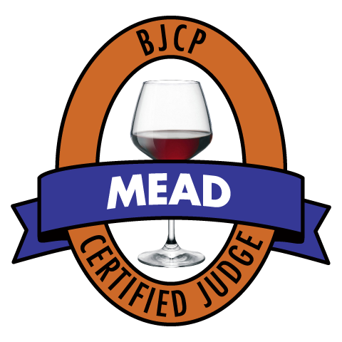

# Beer Judge Certification Program

# 2015 Style Guidelines

## Mead Style Guidelines

### Copyright © 2015, BJCP, Inc.

**The BJCP grants the right to make copies for use in BJCP-sanctioned competitions or for educational/judge training purposes.**

*All other rights reserved.*

Updates available at **www.bjcp.org.**

Edited by Gordon Strong with Kristen England

**Review and Commentary:** Steve Piatz, Michael Fairbrother

**Final Review:** Dennis Mitchell, Agatha Feltus, Michael Wilcox, Brian Eichhorn

# Introduction to Mead Guidelines (Categories M1-M4)

The following discussion applies to all the mead styles, except where explicitly superseded in the sub-category guidelines. This introduction identifies common characteristics and descriptions for all types of mead, and should be used as a reference whenever entering or judging mead.

## 1. Important Attributes

**Sweetness.** A mead may be *dry*, *semi-sweet*, or *sweet*. Sweetness simply refers to the amount of residual sugar in the mead. Sweetness is often confused with fruitiness in a dry mead. Body is related to sweetness, but dry meads can still have some body. Dry meads do not have to be bone dry. Sweet meads should not be cloyingly sweet, and should not have a raw, unfermented honey character. Sweetness is independent of strength. Note that tannin levels can affect the perceived sweetness of mead (more tannin makes a mead seem drier), but acidity is more related to the quality, balance, and enjoyment of the sweetness. The purpose of identifying a sweetness level is primarily to aid in the ordering of a flight. *Minor differences from stated sweetness level should not be heavily-penalized or considered a disqualifying fault.*

**Carbonation.** A mead may be *still*, *petillant*, or *sparkling*. Still meads do not have to be totally flat; they can have some very light bubbles. Petillant meads are lightly sparkling and can have a moderate, noticeable amount of carbonation. Sparkling meads are not gushing, but may have a character ranging from mouth-filling to an impression akin to Champagne or carbonated water. *Minor differences from stated carbonation level should not be heavily-penalized or considered a disqualifying fault.*

**Strength.** A mead may be categorized as *hydromel*, *standard*, or *sack* strength. Strength refers to the alcohol content of the mead (and also, therefore, the amount of honey and fermentables used to make the mead). Stronger meads can have a greater honey character and body (as well as alcohol) than weaker meads, although this is not a strict rule. Well-made stronger examples may have difficult-to-detect strength. *Minor differences from stated strength level should not be heavily-penalized or considered a disqualifying fault.*

**Honey variety.** Some types of honey have a strong varietal character (aroma, flavor, color, acidity). If a honey is unusual, additional information can be provided to judges as to the character to be expected. Note that *wildflower* isn't a varietal honey; it is specifically a term used to describe a honey derived from an unknown source or from mixed flowers or blossoms. Consider providing a description of the honey if it is not listed in the Mead Exam Study Guide or other BJCP references. Identifying the source (state or region) and season of the honey can be useful information for the judges.

**Special ingredients.** Different styles may include fruit, spice, malt, etc. Judges need to understand the ingredients that provide a unique character in order to properly evaluate the mead. Oak additions do not have to be specified (but may be at the entrant's discretion); *oaking is acceptable in every mead style*. Excessive oaking is a fault, just as in wine; any use of oak should be balanced and complimentary. A declared use of oak should not be interpreted as requiring the oak to be a primary flavor.

## 2. Standard Description for Mead

*When individual mead style descriptions use the phrase **Standard Description Applies**, refer to the sections below that have the same names as are used in the style descriptions. These descriptions are incorporated by reference into every style where they are mentioned. Statements in the individual style descriptions build on, modify, or supersede the standard descriptions below.*

**Appearance:** Clarity may be good to brilliant. Crystal clear, reflective examples with a bright, distinct meniscus are highly desirable. Observable particulates (even in an otherwise clear example) are undesirable. Highly carbonated examples usually have a short-lasting head similar to Champagne or soda pop. Some aspects of bubbles or head formation that may be observed and commented upon include size (large or small), persistence (how long do they continue to form?), quantity (how much are present?), rate (how fast do they form?), and mousse (appearance or quality of foam stand). The components of bubbles (or *head*) will vary greatly depending on the carbonation level, ingredients and type of mead. In general, smaller bubbles are more desirable and indicative of higher quality than larger bubbles. The color may vary widely depending on honey variety and any optional ingredients (e.g., fruit, malts). Some honey varieties are almost clear, while others can be dark brown. Most are in the straw to gold range. If no honey variety is declared, almost any color is acceptable. If a honey variety is declared, the color should generally be suggestive of the honey used (although a wide range of color variation is still possible). Hue, saturation and purity of color should be considered. Stronger versions (standard and sack) may show signs of body (e.g., legs, meniscus) but higher carbonation levels can interfere with this perception.

**Aroma:** The intensity of the honey aroma will vary based upon the sweetness and strength of the mead. Stronger or sweeter meads may have a stronger honey aroma than drier or weaker versions. Different varieties of honey have different intensities and characters; some (e.g., orange blossom, buckwheat) are more readily recognizable than others (e.g., avocado, palmetto). If honey varieties are declared, the varietal character of the honey should be apparent even if subtle. The aromatics may seem vinous (similar to wine), and may include fruity, floral, or spicy notes. The bouquet (rich, complex aromatics arising from the combination of ingredients, fermentation and aging) should show a pleasant, clean fermentation character, with fresh aromatics being preferred over dirty, muddled, yeasty, or sulfury notes. A multi-faceted bouquet, also known as complexity or depth, is a positive attribute. Phenolic aromatics should not be present. Harsh or chemical aromatics should not be present. Oxidation is a big detraction in most mead, and most frequently appears as a strong sherry-like or light molasses-like character. A subtle, sherry-like oxidation character can add complexity in some situations, but not if the oxidation ruins the character of the mead. Alcohol aromatics may be present, but hot, solventy or irritating overtones are a defect. The harmony and balance of the aroma and bouquet should be pleasant and enticing.

**Flavor:** The intensity of the honey flavor will vary based upon the sweetness and strength of the mead. Stronger, sweeter meads will have a stronger honey flavor than drier, weaker versions. Different varieties of honey have different intensities and characters; some (e.g., orange blossom, buckwheat) are more readily recognizable than others (e.g., safflower, palmetto). If honey varieties are declared, the varietal character of the honey should be apparent even if subtle. The residual sweetness level will vary with the sweetness of the mead; dry meads will have no residual sugar, sweet meads will have noticeable to prominent sweetness, semi-sweet meads will have a balanced sweetness. In no case should the residual sweetness be syrupy, cloying or seem like unfermented honey. Any additives, such as acid or tannin, should enhance the honey flavor and lend balance to the overall character of the mead but not be excessively tart or astringent. Tannin can make a mead seem drier than the residual sugar levels might suggest. Artificial, chemical, harsh, phenolic or bitter flavors are defects. Higher carbonation (if present) enhances the acidity and gives a "bite" to the finish. The aftertaste should be evaluated; longer finishes are generally most desirable. A multi-faceted flavor, also known as complexity or depth, is a positive attribute. Yeast or fermentation characteristics may be none to noticeable, with estery, fresh and clean flavors being most desirable. Alcohol flavors (if present) should be smooth and well-aged, not harsh, hot, or solventy. Very light oxidation may be present, depending on age, but an excessive molasses, sherry-like or papery character should be avoided. Aging and conditioning generally smooth out flavors and create a more elegant, blended, rounded product. All flavors tend to become more subtle over time, and can deteriorate with extended aging.

**Mouthfeel:** Before evaluating, refer to the declared sweetness, strength and carbonation levels, as well as any special ingredients; these can all affect mouthfeel. Well-made examples will often have an elegant wine-like character. The body can vary widely, although most are in the medium-light to medium-full range. Body generally increases with stronger and/or sweeter meads, and can sometimes be quite full and heavy. Similarly, body generally decreases with lower gravity and/or drier meads, and can sometimes be quite light. Sensations of body should not be accompanied by an overwhelmingly cloying sweetness (even in sweet meads). A very thin or watery body is likewise undesirable. Some natural acidity is often present (particularly in fruit-based meads). Low levels of astringency are sometimes present (either from specific fruit or spices, or from tea, chemical additives or oak-aging). Acidity and tannin help balance the overall honey, sweetness and alcohol presentation. The level of carbonation can vary widely (see definitions above). Still meads may have a very light level of carbonation, lightly carbonated (petillant) meads will have noticeable bubbles, and a highly carbonated (sparkling) mead can range from a mouth-filling carbonation to levels approaching Champagne or soda pop. High carbonation will enhance the acidity and give a "bite" to the finish. A warming alcohol presence is often present, and this character usually increases with strength (although extended aging can smooth this sensation).

**Overall Impression:** A wide range of results are possible, but well-made examples will have an enjoyable balance of honey flavors, sweetness, acidity, tannins, alcohol. Strength, sweetness and age greatly affect the overall presentation. Any special ingredients should be well-blended with the other ingredients, and lead to a harmonious end product.

**Ingredients:** Mead is made primarily from honey, water and yeast. Some minor adjustments in acidity and tannin can be made with citrus fruits, tea, or chemicals; however, these additives should not be readily discernable in flavor or aroma. Yeast nutrients may be used but should not be detected. Oak aging is allowable in any category as a subtle to noticeable enhancement without causing the mead to be an *Experimental Mead*; excessive oak is a fault.

**Vital Statistics:**
    
    OG:     hydromel:   1.035 - 1.080
            standard:   1.080 - 1.120
            sack:       1.120 - 1.170
        
    ABV:    hydromel:   3.5 - 7.5%
            standard:   7.5 - 14.0%
            sack:       14.0 - 18.0%

    FG:     dry:        0.990 - 1.010
            semi-sweet: 1.010 - 1.025
            sweet:      1.025 - 1.050

*Note that the perception of sweetness is a function of the percentage of residual sugar, so don't rely only on FG to determine sweetness. Consider the OG, strength, tannin levels, and to a lesser extent, acidity, in assessing sweetness.*

**IBUs:** not relevant for anything but braggot, but bittering hops are optional even in this style.

**SRM:** basically irrelevant since honey can be anything from almost clear to dark brown. Cysers are most often golden. Other fruit-based meads and pyments can have orange, red, pink and/or purple hues. Braggots can be yellow to black. In all cases, the color should reflect the ingredients used (type of honey, and fruit and/or malt in some styles).

## 3. Competition Entry Instructions

-   **Mandatory Requirements:**

    -   Entrants **MUST** specify *carbonation* level (still; petillant or lightly carbonated; sparkling or highly carbonated).

    -   Entrants **MUST** specify *strength* level (hydromel or light mead; standard mead; sack or strong mead).

    -   Entrants **MUST** specify *sweetness* level (dry; semi-sweet or medium; sweet).

*Minor differences from stated levels should not be heavily penalized or be considered a disqualifying fault.*

**Optional Requirements:** Entrants **MAY** specify honey varieties used, as well as the source and season of the honey. If honey varieties are declared, judges will look for the varietal character of the honey. Note that the character of a varietal honey will be identifiable as distinct to the source flowers, but may not resemble the source plant, tree, or fruit. For example, orange-blossom honey has the character of orange blossoms, not oranges; blackberry honey is only distantly like blackberries, although it is an identifiable character. If a mead is oak-aged and the oak character is noticeable, the oaking can be specified. Judges should expect to detect oak, but not as a primary flavor.

**Category-Specific Requirements:** Some categories require additional information, particularly in categories other than traditional mead. For example, declaring specific fruit, spices, or special characteristics. Supplemental materials may be provided to judges if an obscure or unusual ingredient or method is used.

**Defaults:** If no attributes are specified, judges should evaluate the mead as a semi-sweet, petillant, standard-strength mead with no varietal honey character and no special ingredients. Competition organizers should make every effort to ensure that judges are provided the full set of attributes of the meads being evaluated.

# M1. Traditional Mead

See the Introduction to Mead Guidelines for detailed descriptions of standard mead characteristics, an explanation of standard terms, and entering instructions.

## M1A. Dry Mead

**Overall Impression:** Similar in balance, body, finish and flavor intensity to a dry white wine, with a pleasant mixture of subtle honey character, soft fruity esters, and clean alcohol. Complexity, harmony, and balance of sensory elements are most desirable, with no inconsistencies in color, aroma, flavor or aftertaste. The proper balance of sweetness, acidity, alcohol, and honey character is the essential final measure of any mead.

**Aroma:** Honey aroma may be subtle, although not always identifiable. Sweetness or significant honey aromatics should not be expected. If a honey variety is declared, the variety should be distinctive (if noticeable). Different types of honey have different intensities and characters. Standard description applies for remainder of characteristics.

**Appearance:** Standard description applies.

**Flavor:** Subtle (if any) honey character, and may feature subtle to noticeable varietal character if a varietal honey is declared (different varieties have different intensities). Residual sweetness levels are minimal to none. Dry finish. May have more noticeable acidity due to low sweetness levels. Tannin levels may make a sweeter mead seem dry. Sulfury, harsh or yeasty fermentation characteristics are undesirable. Standard description applies for remainder of characteristics.

**Mouthfeel:** Standard description applies, although the body is generally medium to light (but not watery). Note that stronger meads can have a fuller body. Sensations of body should not be accompanied by noticeable residual sweetness.

**Ingredients:** Standard description applies. Traditional Meads feature the character of a blended honey or a blend of honeys. Varietal meads feature the distinctive character of certain honeys. *Show meads* feature no additives, but this distinction is usually not obvious to judges.

**Entry Instructions:** *See* Introduction to Mead Guidelines *for entry requirements.* Entrants **MUST** specify carbonation level and strength. Sweetness is assumed to be DRY in this category. Entrants **MAY** specify honey varieties.

**Commercial Examples:** White Winter Dry Mead, Sky River Dry Mead, Intermiel Bouquet Printanier

## M1B. Semi-Sweet Mead

**Overall Impression:** Similar in balance, body, finish and flavor intensity to a semi-sweet (or medium-dry) white wine, with a pleasant mixture of honey character, light sweetness, soft fruity esters, and clean alcohol. Complexity, harmony, and balance of sensory elements are most desirable, with no inconsistencies in color, aroma, flavor or aftertaste. The proper balance of sweetness, acidity, alcohol, and honey character is the essential final measure of any mead.

**Aroma:** Honey aroma should be noticeable, and can have a light sweetness that may express the aroma of flower nectar. If a variety of honey is declared, the aroma might have a subtle to very noticeable varietal character reflective of the honey (different varieties have different intensities and characters). Standard description applies for remainder of characteristics.

**Appearance:** Standard description applies.

**Flavor:** Subtle to moderate honey character, and may feature subtle to noticeable varietal character if a varietal honey is declared (different varieties have different intensities). Residual sweetness levels are subtle to moderate. Medium-dry to lightly sweet finish. Tannin levels may make a sweet mead seem medium-dry. Sulfury, harsh or yeasty fermentation characteristics are undesirable. Standard description applies for remainder of characteristics.

**Mouthfeel:** Standard description applies, although the body is generally medium-light to medium-full. Note that stronger meads can have a fuller body. Sensations of body should not be accompanied by a residual sweetness that is higher than moderate.

**Ingredients:** Standard description applies. Traditional Meads feature the character of a blended honey or a blend of honeys. Varietal meads feature the distinctive character of certain honeys. *Show meads* feature no additives, but this distinction is usually not obvious to judges.

**Entry Instructions:** *See* Introduction to Mead Guidelines *for entry requirements.* Entrants **MUST** specify carbonation level and strength. Sweetness is assumed to be SEMI-SWEET in this category. Entrants **MAY** specify honey varieties.

**Commercial Examples:** Lurgashall English Mead, Redstone Traditional Mountain Honey Wine, Sky River Semi-Sweet Mead, Intermiel Verge d'Or and Mélilot

## M1C. Sweet Mead

**Overall Impression:** Similar in balance, body, finish and flavor intensity to a well-made dessert wine (such as Sauternes), with a pleasant mixture of honey character, residual sweetness, soft fruity esters, and clean alcohol. Complexity, harmony, and balance of sensory elements are most desirable, with no inconsistencies in color, aroma, flavor or aftertaste. The proper balance of sweetness, acidity, alcohol, and honey character is the essential final measure of any mead.

**Aroma:** Honey aroma should dominate, and is often moderately to strongly sweet and usually expresses the aroma of flower nectar. If a variety of honey is declared, the aroma might have a subtle to very noticeable varietal character reflective of the honey (different varieties have different intensities and characters). Standard description applies for remainder of characteristics.

**Appearance:** Standard description applies.

**Flavor:** Moderate to significant honey character, and may feature moderate to prominent varietal character if a varietal honey is declared (different varieties have different intensities). Residual sweetness levels are moderate to high. Sweet and full (but not cloying) finish. Balanced acidity and/or tannin helps keep the sweetness agreeable to the palate without being overwhelming. Sulfury, harsh or yeasty fermentation characteristics are undesirable. Standard description applies for remainder of characteristics.

**Mouthfeel:** Standard description applies, although the body is generally medium-full to full. Note that stronger meads will have a fuller body. Many examples will seem like a dessert wine. Sensations of body should not be accompanied by cloying, raw (unfermented) residual sweetness.

**Ingredients:** Standard description applies. Traditional Meads feature the character of a blended honey or a blend of honeys. Varietal meads feature the distinctive character of certain honeys. *Show meads* feature no additives, but this distinction is usually not obvious to judges.

**Entry Instructions:** *See* Introduction to Mead Guidelines *for entry requirements.* Entrants **MUST** specify carbonation level and strength. Sweetness is assumed to be SWEET in this category. Entrants **MAY** specify honey varieties.

**Commercial Examples:** Moonlight Sensual, Lurgashall Christmas Mead, Chaucer's Mead, Rabbit's Foot Sweet Wildflower Honey Mead, Intermiel Benoîte

# M2. Fruit Mead

A mead made with fruit is called a **Melomel**, although some melomels also have other names (cyser, pyment). We are introducing category names for certain types of melomels based on the variety of fruit used; these are more entry categories than actual styles. We selected different names for the category and subcategories to avoid the confusion of using the same names in different ways.

See the Introduction to Mead Guidelines for detailed descriptions of standard mead characteristics, an explanation of standard terms, and entering instructions.

Refer to Category M1 descriptions for additional detail on the character to be expected from dry, semi-sweet and sweet meads. Use those guidelines to judge distinctions between the various sweetness levels. Judging meads from dry to sweet is recommended as the primary ordering, with strength being the secondary ordering criterion.

## M2A. Cyser

A **Cyser** is a melomel made with apples (generally cider).

**Overall Impression:** In well-made examples of the style, the fruit is both distinctive and well-incorporated into the honey-sweet-acid-tannin-alcohol balance of the mead. Some of the best strong examples have the taste and aroma of an aged Calvados (apple brandy from northern France), while subtle, dry versions can taste similar to many fine white wines. There should be an appealing blend of the fruit and honey character but not necessarily an even balance. Generally a good tannin-sweetness balance is desired, though very dry and very sweet examples do exist.

**Aroma:** Depending on the sweetness and strength, a subtle to distinctly identifiable honey and apple/cider character (dry and/or hydromel versions will tend to have lower aromatics than sweet and/or sack versions). The apple/cider character should be clean and distinctive; it can express a range of apple-based character ranging from a subtle fruitiness to a single varietal apple character (if declared) to a complex blend of apple aromatics. Some spicy or earthy notes may be present, as may a slightly sulfury character. The honey aroma should be noticeable, and can have a light to significant sweetness that may express the aroma of flower nectar. If a variety of honey is declared, the aroma might have a subtle to very noticeable varietal character reflective of the honey (different varieties have different intensities and characters). The bouquet should show a pleasant fermentation character, with clean and fresh aromatics being preferred. Stronger and/or sweeter versions will have higher alcohol and sweetness in the nose. Slight spicy phenolics from certain apple varieties are acceptable, as is a light diacetyl character from malolactic fermentation (both are optional). Standard description applies for remainder of characteristics.

**Appearance:** Standard description applies, except with regard to color. Color may range from pale straw to deep golden amber (most are yellow to gold), depending on the variety of honey and blend of apples or ciders used.

**Flavor:** The apple and honey flavor intensity may vary from none to high; the residual sweetness may vary from none to high; and the finish may range from dry to sweet, depending on what sweetness level has been declared (dry to sweet) and strength level has been declared (hydromel to sack). Natural acidity and tannin in apples may give some tartness and astringency to balance the sweetness, honey flavor and alcohol. Tannin levels may make a cyser seem drier than the residual sugar levels might suggest. A cyser may have a subtle to strong honey character, and may feature noticeable to prominent varietal character if a varietal honey is declared (different varieties have different intensities). Slight spicy phenolics from certain apple varieties are acceptable, as are a light diacetyl character from malolactic fermentation and a slight sulfur character (all are optional). Standard description applies for remainder of characteristics.

**Mouthfeel:** Standard description applies. Often wine-like. Some natural acidity is usually present (from the blend of apples) and helps balance the overall impression. Some apples can provide natural astringency, but this character should not be excessive.

**Ingredients:** Standard description applies. Cyser is a mead made with the addition of apples or apple juice. Traditionally, cysers are made by the addition of honey to apple juice without additional water.

**Entry Instructions:** *See* Introduction to Mead Guidelines *for entry requirements.* [ ]{.underline} Entrants **MUST** specify carbonation level, strength, and sweetness. Entrants **MAY** specify honey varieties. Entrants **MAY** specify the varieties of apple used; if specified, a varietal character will be expected. Products with a relatively low proportion of honey are better entered as a *Specialty Cider*. A spiced cyser should be entered as a *Fruit and Spice Mead*. A cyser with other fruit should be entered as a *Melomel*. A cyser with additional ingredients should be entered as an *Experimental Mead*.

**Commercial Examples:** Moonlight Blossom, White Winter Cyser, Rabbit's Foot Apple Cyser

## M2B. Pyment

A **Pyment** is a melomel made with grapes (generally from juice). Pyments can be red, white, or blush, just as with wine.

**Overall Impression:** In well-made examples of the style, the grape is both distinctively vinous and well-incorporated into the honey-sweet-acid-tannin-alcohol balance of the mead. White and red versions can be quite different, and the overall impression should be characteristic of the type of grapes used and suggestive of a similar variety wine. There should be an appealing blend of the fruit and honey character but not necessarily an even balance. Generally a good tannin-sweetness balance is desired, though very dry and very sweet examples do exist.

**Aroma:** Depending on the sweetness and strength, a subtle to distinctly identifiable honey and grape/wine character (dry and/or hydromel versions will tend to have lower aromatics than sweet and/or sack versions). The grape/wine character should be clean and distinctive; it can express a range of grape-based character ranging from a subtle fruitiness to a single varietal grape character (if declared) to a complex blend of grape or wine aromatics. Some complex, spicy, grassy or earthy notes may be present (as in wine). The honey aroma should be noticeable, and can have a light to significant sweetness that may express the aroma of flower nectar. If a variety of honey is declared, the aroma might have a subtle to very noticeable varietal character reflective of the honey (different varieties have different intensities and characters). The bouquet should show a pleasant fermentation character, with clean and fresh aromatics being preferred. Stronger and/or sweeter versions will have higher alcohol and sweetness in the nose. Slight spicy phenolics from certain red grape varieties are acceptable, as is a light diacetyl character from malolactic fermentation in certain white grape varieties (both are optional). Standard description applies for remainder of characteristics.

**Appearance:** Standard description applies, except with regard to color. Color may range from pale straw to deep purple-red, depending on the variety of grapes and honey used. The color should be characteristic of the variety or type of grape used, although white grape varieties may also take on color derived from the honey variety.

**Flavor:** The grape/wine and honey flavor intensity may vary from subtle to high; the residual sweetness may vary from none to high; and the finish may range from dry to sweet, depending on what sweetness level has been declared (dry to sweet) and strength level has been declared (hydromel to sack). Natural acidity and tannin in grapes may give some tartness and astringency to balance the sweetness, honey flavor and alcohol. A pyment may have a subtle to strong honey character, and may feature noticeable to prominent varietal character if a varietal honey is declared (different varieties have different intensities). Depending on the grape variety, some fruity, spicy, grassy, buttery, earthy, minerally, and/or floral flavors may be present. Some versions (particularly red pyments) may be oak-aged, with additional flavor complexity. Tannin levels may make the pyment seem drier than residual sugar levels might suggest. Standard description applies for remainder of characteristics.

**Mouthfeel:** Standard description applies. Wine-like. Some natural acidity is usually present (from grapes) and helps balance the overall impression. Grape tannin and/or grape skins can add body as well as some astringency, although this character should not be excessive. Use of oak can also add this character. Longer aging can smooth out tannin-based astringency.

**Ingredients:** Standard description applies. A pyment is a mead made with the addition of grapes or grape juices. Alternatively, the pyment may be a homemade grape-based wine sweetened with honey, or a mead mixed with homemade grape-based wine after fermentation.

**Entry Instructions:** *See* Introduction to Mead Guidelines *for entry requirements.* Entrants **MUST** specify carbonation level, strength, and sweetness. Entrants **MAY** specify honey varieties. Entrants **MAY** specify the varieties of grape used; if specified, a varietal character will be expected. A spiced pyment (hippocras) should be entered as a *Fruit and Spice Mead.* A pyment made with other fruit should be entered as a *Melomel*. A pyment with other ingredients should be entered as an *Experimental Mead.*

**Commercial Examples:** Celestial Meads Que Syrah, Moonlight Slow Dance, Redstone Pinot Noir and White Pyment Mountain Honey Wines

## M2C. Berry Mead

A **Berry Mead** is an entry category for melomels made with berries, such as raspberries, blueberries, blackberries, currants (black, red, and white), strawberries, boysenberries, elderberries, marionberries, mulberries, lingonberries, huckleberries, cranberries, etc. Generally any fruit with 'berry' in the name would qualify. Berries can have seeds, but do not have stones/pits; some are aggregates of druplets. Combinations of berries can be entered here. The culinary, not botanical, definition of berry is used here. If you have to justify a fruit using the word "technically" as part of the description, then that's not what we mean.

**Overall Impression:** In well-made examples of the style, the fruit is both distinctive and well-incorporated into the honey-sweet-acid-tannin-alcohol balance of the mead. Different types of fruit can result in widely different characteristics; allow for a variation in the final product.

**Aroma:** Depending on the sweetness and strength, a subtle to distinctly identifiable honey and fruit character (dry and/or hydromel versions will tend to have lower aromatics than sweet and/or sack versions). The fruit character should display distinctive aromatics associated with the particular fruit(s); however, note that some fruit (e.g., raspberries) have stronger aromas and are more distinctive than others (e.g., blueberries, strawberries) - allow for a range of fruit character and intensity from subtle to aggressive. The fruit character should be pleasant and supportive, not artificial, raw, and/or inappropriately overpowering (considering the character of the fruit). In a blended berry mead, not all fruit may be individually identifiable or of equal intensity. The honey aroma should be noticeable, and can have a light to significant sweetness that may express the aroma of flower nectar. If a variety of honey is declared, the aroma might have a subtle to very noticeable varietal character reflective of the honey (different varieties have different intensities and characters). The bouquet should show a pleasant fermentation character, with clean and fresh aromatics being preferred. Stronger and/or sweeter versions will have higher alcohol and sweetness in the nose. Some tartness may be present if naturally occurring in the particular fruit(s), but should not be inappropriately intense. Standard description applies for remainder of characteristics.

**Appearance:** Standard description applies, except with regard to color. Color may take on a very wide range of colors, depending on the variety of fruit and/or honey used. For lighter-colored meads with fruits that exhibit distinctive colors, the color should be noticeable. Note that the color of fruit in mead is often lighter than the flesh of the fruit itself and may take on slightly different shades. Meads made with lighter color fruits can also take on color from varietal honeys. In meads that produce a head, the head can take on some of the fruit color as well.

**Flavor:** The fruit and honey flavor intensity may vary from subtle to high; the residual sweetness may vary from none to high; and the finish may range from dry to sweet, depending on what sweetness level has been declared (dry to sweet) and strength level has been declared (hydromel to sack). The natural acidity and tannin levels from fruit and fruit skins will vary, and this character is expected to be present in the mead, although in balance with sweetness, honey flavor, and alcohol. Tannin levels may make some meads seem drier than the residual sweetness might suggest. A berry mead may have a subtle to strong honey character, and may feature noticeable to prominent varietal character if a varietal honey is declared (different varieties have different intensities). The distinctive flavor character associated with the particular fruit(s) should be noticeable, and may range in intensity from subtle to aggressive. The balance of fruit with the underlying mead is vital, and the fruit character should not be artificial, raw (unfermented), and/or inappropriately overpowering. In a blended berry mead, not all fruit may be individually identifiable or of equal intensity. Standard description applies for remainder of characteristics.

**Mouthfeel:** Standard description applies. Most will be wine-like. Some natural acidity and/or tannin are sometimes present (from certain fruit and/or fruit skin) and helps balance the overall impression. Fruit tannin can add body as well as some astringency. High levels of astringency are undesirable. The acidity and tannin levels should be somewhat reflective of the fruit used.

**Ingredients:** Standard description applies. A berry mead is a mead made with the addition of other berries or berry juices, including a blend of berries. There should be an appealing blend of the fruit and honey character but not necessarily an even balance.

**Comments:** Generally a good tannin-sweetness balance is desired, though very dry and very sweet examples do exist. Some fruits, notably darker ones like blackberries, may contribute a tannin presence similar to a red wine.

**Entry Instructions:** *See* Introduction to Mead Guidelines *for entry requirements.* Entrants **MUST** specify carbonation level, strength, and sweetness. Entrants **MAY** specify honey varieties. Entrants **MUST** specify the varieties of fruit used. A mead made with both berries and non-berry fruit (including apples and grapes) should be entered as a *Melomel*. A berry mead that is spiced should be entered as a *Fruit and Spice Mead.* A berry mead containing other ingredients should be entered as an *Experimental Mead*.

**Commercial Examples:** Moonlight Blissful, Wild, Caress, and Mischief, White Winter Blueberry, Raspberry and Strawberry Melomels, Celestial Meads Miel Noir, Redstone Black Raspberry Nectar, Bees Brothers Raspberry Mead, Intermiel Honey Wine and Raspberries, Honey Wine and Blueberries, and Honey Wine and Blackcurrants, Mountain Meadows Cranberry Mead

## M2D. Stone Fruit Mead

A **Stone Fruit Mead** is an entry category for melomels made with stone fruit, such as cherries, plums, peaches, apricots, and mangoes. Stone fruit are fleshy fruit with a single large pit or stone. The culinary, not botanical, definition of stone fruit is used here. If you have to justify a fruit using the word "technically" as part of the description, then that's not what we mean. Combinations of stone fruit can be entered here.

**Overall Impression:** In well-made examples of the style, the fruit is both distinctive and well-incorporated into the honey-sweet-acid-tannin-alcohol balance of the mead. Different types of fruit can result in widely different characteristics; allow for a variation in the final product.

**Aroma:** Depending on the sweetness and strength, a subtle to distinctly identifiable honey and fruit character (dry and/or hydromel versions will tend to have lower aromatics than sweet and/or sack versions). The fruit character should display distinctive aromatics associated with the particular fruit(s); however, note that some fruit (e.g., cherries) have stronger aromas and are more distinctive than others (e.g., peaches) - allow for a range of fruit character and intensity from subtle to aggressive. The fruit character should be pleasant and supportive, not artificial, raw and/or inappropriately overpowering (considering the character of the fruit). In a blended stone fruit mead, not all the fruits may be individually identifiable or of equal intensity. The honey aroma should be noticeable, and can have a light to significant sweetness that may express the aroma of flower nectar. If a variety of honey is declared, the aroma might have a subtle to very noticeable varietal character reflective of the honey (different varieties have different intensities and characters). The bouquet should show a pleasant fermentation character, with clean and fresh aromatics being preferred. Stronger and/or sweeter versions will have higher alcohol and sweetness in the nose. Some tartness may be present if naturally occurring in the particular fruit(s), but should not be inappropriately intense. Standard description applies for remainder of characteristics.

**Appearance:** Standard description applies, except with regard to color. Color may take on a very wide range of colors, depending on the variety of fruit and/or honey used. For lighter-colored meads with fruits that exhibit distinctive colors, the color should be noticeable. Note that the color of fruit in mead is often lighter than the flesh of the fruit itself and may take on slightly different shades. Meads made with lighter color fruits can also take on color from varietal honeys. In meads that produce a head, the head can take on some of the fruit color as well.

**Flavor:** The fruit and honey flavor intensity may vary from subtle to high; the residual sweetness may vary from none to high; and the finish may range from dry to sweet, depending on what sweetness level has been declared (dry to sweet) and strength level has been declared (hydromel to sack). The natural acidity and tannin levels from fruit and fruit skins will vary, and this character is expected to be present in the mead, although in balance with sweetness, honey flavor, and alcohol. Tannin levels may make some meads seem drier than the residual sweetness might suggest. A stone fruit mead may have a subtle to strong honey character, and may feature noticeable to prominent varietal character if a varietal honey is declared (different varieties have different intensities). The distinctive flavor character associated with the particular fruit(s) should be noticeable, and may range in intensity from subtle to aggressive. The balance of fruit with the underlying mead is vital, and the fruit character should not be artificial, raw (unfermented), and/or inappropriately overpowering. In a blended stone fruit mead, not all the fruits may be individually identifiable or of equal intensity. Standard description applies for remainder of characteristics.

**Mouthfeel:** Standard description applies. Most will be wine-like. Some natural acidity and/or tannin are sometimes present (from certain fruit and/or fruit skin) and helps balance the overall impression. Fruit tannin can add body as well as some astringency. High levels of astringency are undesirable. The acidity and tannin levels should be somewhat reflective of the fruit used.

**Ingredients:** Standard description applies. A stone fruit mead is a mead made with the addition of other stone fruit or stone fruit juices. There should be an appealing blend of the fruit and honey character but not necessarily an even balance. A stone fruit mead can be made with a blend of stone fruits, but not other fruit not allowable in this category.

**Comments:** Generally a good tannin-sweetness balance is desired, though very dry and very sweet examples do exist.

**Entry Instructions:** *See* Introduction to Mead Guidelines *for entry requirements.* Entrants **MUST** specify carbonation level, strength, and sweetness. Entrants **MAY** specify honey varieties. Entrants **MUST** specify the varieties of fruit used. A stone fruit mead that is spiced should be entered as a *Fruit and Spice Mead.* A stone fruit mead that contains non-stone fruit should be entered as a *Melomel*. A stone fruit mead that contains other ingredients should be entered as an *Experimental Mead*.

**Commercial Examples:** Mountain Meadows Cherry Mead, Moonlight Entice, Sumptuous, Flirt, and Smitten, Redstone Sunshine Nectar

## M2E. Melomel

The **melomel** subcategory is for fruit meads made with any fruit not associated with any other fruit mead subcategory, or with a combination of fruits from multiple fruit mead subcategories (such as grapes and stone fruit). Some examples include citrus fruit, dried fruits (dates, prunes, raisins, etc.), pears, figs, pomegranates, prickly pear, bananas, pineapples, and most other tropical fruit. If in doubt, enter the fruit here - judges should be flexible with fruit not explicitly named in other categories. The use of Melomel as a subcategory name does not imply that other meads in the Fruit Mead category are not also melomels; the choice was made to avoid using the same word twice in different contexts. The culinary, not botanical, definition of fruit is used here. If you have to justify a fruit using the word "technically" as part of the description, then that's not what we mean.

**Overall Impression:** In well-made examples of the style, the fruit is both distinctive and well-incorporated into the honey-sweet-acid-tannin-alcohol balance of the mead. Different types of fruit can result in widely different characteristics; allow for a variation in the final product.

**Aroma:** Depending on the sweetness and strength, a subtle to distinctly identifiable honey and fruit character (dry and/or hydromel versions will tend to have lower aromatics than sweet and/or sack versions). The fruit character should display distinctive aromatics associated with the particular fruit(s); however, note that some fruit have stronger aromas and are more distinctive than others - allow for a range of fruit character and intensity from subtle to aggressive. The fruit character should be pleasant and supportive, not artificial, raw (unfermented), and/or inappropriately overpowering (considering the character of the fruit). In a blended fruit melomel, not all the fruits may be individually identifiable or of equal intensity. The honey aroma should be noticeable, and can have a light to significant sweetness that may express the aroma of flower nectar. If a variety of honey is declared, the aroma might have a subtle to very noticeable varietal character reflective of the honey (different varieties have different intensities and characters). The bouquet should show a pleasant fermentation character, with clean and fresh aromatics being preferred. Stronger and/or sweeter versions will have higher alcohol and sweetness in the nose. Some tartness may be present if naturally occurring in the particular fruit(s), but should not be inappropriately intense. Standard description applies for remainder of characteristics.

**Appearance:** Standard description applies, except with regard to color. Color may take on a very wide range of colors, depending on the variety of fruit and/or honey used. For lighter-colored melomels with fruits that exhibit distinctive colors, the color should be noticeable. Note that the color of fruit in mead is often lighter than the flesh of the fruit itself and may take on slightly different shades. Meads made with lighter color fruits can also take on color from varietal honeys. In meads that produce a head, the head can take on some of the fruit color as well.

**Flavor:** The fruit and honey flavor intensity may vary from subtle to high; the residual sweetness may vary from none to high; and the finish may range from dry to sweet, depending on what sweetness level has been declared (dry to sweet) and strength level has been declared (hydromel to sack). The natural acidity and tannin levels from fruit and fruit skins will vary, and this character is expected to be present in the mead, although in balance with sweetness, honey flavor, and alcohol. Tannin levels may make some meads seem drier than the residual sweetness might suggest. A melomel may have a subtle to strong honey character, and may feature noticeable to prominent varietal character if a varietal honey is declared (different varieties have different intensities). The distinctive flavor character associated with the particular fruit(s) should be noticeable, and may range in intensity from subtle to aggressive. The balance of fruit with the underlying mead is vital, and the fruit character should not be artificial, raw (unfermented), and/or inappropriately overpowering. In a melomel made with a combination of fruits, not all the fruits may be individually identifiable or of equal intensity. Standard description applies for remainder of characteristics.

**Mouthfeel:** Standard description applies. Most will be wine-like. Some natural acidity and/or tannin are sometimes present (from certain fruit and/or fruit skin) and helps balance the overall impression. Fruit tannin can add body as well as some astringency. High levels of astringency are undesirable. The acidity and tannin levels should be somewhat reflective of the fruit used.

**Ingredients:** Standard description applies. A melomel is a mead made with the addition of other fruit or fruit juices not specifically reserved for other entry subcategories. There should be an appealing blend of the fruit and honey character but not necessarily an even balance. A melomel can be made with a blend of fruits from multiple *Fruit Mead* subcategories.

**Comments:** Generally a good tannin-sweetness balance is desired, though very dry and very sweet examples do exist.

**Entry Instructions:** *See* Introduction to Mead Guidelines *for entry requirements.* Entrants **MUST** specify carbonation level, strength, and sweetness. Entrants **MAY** specify honey varieties. Entrants **MUST** specify the varieties of fruit used. A melomel that is spiced should be entered as a *Fruit and Spice Mead*. A melomel containing other ingredients should be entered as an *Experimental Mead*. Melomels made with either apples or grapes as the only fruit source should be entered as a *Cyser* or *Pyment*, respectively. Melomels with apples or grapes, plus other fruit should be entered in this category, not *Experimental Mead*.

**Commercial Examples:** Moonlight Desire, Paramour, and Iniquity

# M3. Spiced Mead

See the Introduction to Mead Guidelines for detailed descriptions of standard mead characteristics, an explanation of standard terms, and entering instructions.

Refer to Category M1 descriptions for additional detail on the character to be expected from dry, semi-sweet and sweet meads. Use those guidelines to judge distinctions between the various sweetness levels. Judging meads from dry to sweet is recommended as the primary ordering, with strength being the secondary ordering criterion.

## M3A. Fruit and Spice Mead

A **Fruit and Spice Mead** is a mead containing one or more fruits and one or more spices. See the definitions of fruit used in the various Fruit Mead subcategories; any ingredient qualifying there meets the "fruit" requirement here. For purposes of this subcategory, any ingredient qualifying for use in the Spice, Herb, or Vegetable Mead subcategory also meets the "spice" requirement here.

**Overall Impression:** In well-made examples of the style, the fruits and spices are both distinctive and well-incorporated into the honey-sweet-acid-tannin-alcohol balance of the mead. Different types of fruits and spices can result in widely different characteristics; allow for significant variation in the final product.

**Aroma:** Depending on the sweetness and strength, a subtle to distinctly identifiable honey, fruit, and spice character (dry and/or hydromel versions will tend to have lower aromatics than sweet and/or sack versions). The spice character should display distinctive aromatics associated with the particular spices; however, note that some spices (e.g., ginger, cinnamon) have stronger aromas and are more distinctive than others (e.g., chamomile, lavender) - allow for a range of spice character and intensity from subtle to aggressive. The spice character should be pleasant and supportive, not artificial and inappropriately overpowering (considering the character of the spice). The fruit character should display distinctive aromatics associated with the particular fruit; however, note that some fruits (e.g., raspberry, cherry) have stronger aromas and are more distinctive than others (e.g., peach) - allow for a range of fruit character and intensity from subtle to aggressive. The fruit character should be pleasant and supportive, not artificial, raw (unfermented) and/or inappropriately overpowering (considering the character of the fruit). In a mead with more than one fruit and/or spice, not all fruits and spices may be individually identifiable or of equal intensity. The honey aroma should be noticeable, and can have a light to significant sweetness that may express the aroma of flower nectar. If a variety of honey is declared, the aroma might have a subtle to very noticeable varietal character reflective of the honey (different varieties have different intensities and characters). The bouquet should show a pleasant fermentation character, with clean and fresh aromatics being preferred. Stronger and/or sweeter versions will have higher alcohol and sweetness in the nose. Some spices may produce spicy or peppery phenolics. Standard description applies for remainder of characteristics.

**Appearance:** Standard description applies, except perhaps to note that the color usually won't be affected by spices (although flowers, petals and peppers may provide subtle colors; tea blends may provide significant colors). The fruit may provide significant color, and is generally evocative of the fruit used (although it may be of a lighter shade than the fruit skin).

**Flavor:** The spice flavor intensity may vary from subtle to high; the fruit flavor intensity may vary from subtle to high; the honey flavor intensity may vary from subtle to high; the residual sweetness may vary from none to high; and the finish may range from dry to sweet, depending on what sweetness level has been declared (dry to sweet) and strength level has been declared (hydromel to sack). The distinctive flavor character associated with the particular spices may range in intensity from subtle to aggressive (although some spices may not be individually recognizable, and can just serve to add a background complexity). Certain spices might add bitter, astringent, phenolic or spicy (hot) flavors; if present, these qualities should be related to the declared ingredients (otherwise, they are faults), and they should balance and blend with the honey, sweetness and alcohol. The distinctive flavor character associated with the particular fruits may range in intensity from subtle to aggressive (although some fruits may not be individually recognizable, and can just serve to add a background complexity). Certain fruits might add acidic, bitter, astringent or flavors; if present, these qualities should be related to the declared ingredients (otherwise, they are faults), and they should balance and blend with the honey, sweetness and alcohol. Meads containing more than one fruit or spice should have a pleasant balance of the different fruits and spices, but this does not mean that all fruits and spices need to be of equal intensity or even individual identifiable. The mead may have a subtle to strong honey character, and may feature noticeable to prominent varietal character if a varietal honey is declared (different varieties have different intensities). Standard description applies for remainder of characteristics.

**Mouthfeel:** Standard description applies. Some fruits and spices may contain tannins that add a bit of body and some astringency, but this character should not be excessive.

**Ingredients:** Standard description applies. See the various *Fruit Mead* descriptions, as well as the *Spice, Herb, or Vegetable Mead* description for additional details.

**Comments:** Often, a blend of fruits and spices may give a character greater than the sum of its parts. The better examples of this style often use spices judiciously; when more than one spice are used, they are carefully selected so that they blend harmoniously with the fruit and with each other.

**Entry Instructions:** *See* Introduction to Mead Guidelines *for entry requirements.* Entrants **MUST** specify carbonation level, strength, and sweetness. Entrants **MAY** specify honey varieties. Entrants **MUST** specify the types of spices used, (although well-known spice blends may be referred to by common name, such as apple pie spices). Entrants **MUST** specify the types of fruits used. If only combinations of spices are used, enter as a *Spice, Herb, or Vegetable Mead*. If only combinations of fruits are used, enter as a *Melomel*. If other types of ingredients are used, enter as an *Experimental Mead*.

**Commercial Examples:** Moonlight Kurt's Apple Pie, Mojo, Flame, Fling, and Deviant, Celestial Meads Scheherazade, Rabbit's Foot Private Reserve Pear Mead, Intermiel Rosée

## M3B. Spice, Herb or Vegetable Mead

A **Spice, Herb, or Vegetable Mead** contains one or more spices, herbs, or vegetables (in this style definition, these are collectively known as "spices"). The culinary, not botanical, definition of spice, herb, or vegetable is used here. If you have to justify a spice, herb, or vegetable using the word "technically" as part of the description, then that's not what we mean. The same definitions apply to this category as to the similarly-named beer category. In addition to the more obvious spices, herbs, and vegetables that fit into this subcategory, the following ingredients also are explicitly included: roses, rose hips, ginger, rhubarb, pumpkins, chile peppers, coffee, chocolate, nuts (including coconut), citrus peels/zest, and teas (except those strictly used for increasing tannin levels, not for adding flavor).

**Overall Impression:** In well-made examples of the style, the spices are both distinctive and well-incorporated into the honey-sweet-acid-tannin-alcohol balance of the mead. Different types of spices can result in widely different characteristics; allow for a variation in the final product.

**Aroma:** Depending on the sweetness and strength, a subtle to distinctly identifiable honey and spice character (dry and/or hydromel versions will tend to have lower aromatics than sweet and/or sack versions). The spice character should display distinctive aromatics associated with the particular spices; however, note that some spices (e.g., ginger, cinnamon) have stronger aromas and are more distinctive than others (e.g., chamomile, lavender) - allow for a range of spice character and intensity from subtle to aggressive. The spice character should be pleasant and supportive, not artificial and inappropriately overpowering (considering the character of the spice). In a blended spice mead, not all spices may be individually identifiable or of equal intensity. The honey aroma should be noticeable, and can have a light to significant sweetness that may express the aroma of flower nectar. If a variety of honey is declared, the aroma might have a subtle to very noticeable varietal character reflective of the honey (different varieties have different intensities and characters). The bouquet should show a pleasant fermentation character, with clean and fresh aromatics being preferred. Stronger and/or sweeter versions will have higher alcohol and sweetness in the nose. Some herbs and spices may produce spicy or peppery phenolics. Standard description applies for remainder of characteristics.

**Appearance:** Standard description applies, except perhaps to note that the color usually won't be affected by spices and herbs (although flowers, petals and peppers may provide subtle colors; tea blends may provide significant colors).

**Flavor:** The spice flavor intensity may vary from subtle to high; the honey flavor intensity may vary from subtle to high; the residual sweetness may vary from none to high; and the finish may range from dry to sweet, depending on what sweetness level has been declared (dry to sweet) and strength level has been declared (hydromel to sack). The distinctive flavor character associated with the particular spices may range in intensity from subtle to aggressive (although some spices may not be individually recognizable, and can just serve to add a background complexity). Certain herbs and spices might add bitter, astringent, phenolic or spicy (hot) flavors; if present, these qualities should be related to the declared ingredients (otherwise, they are faults), and they should balance and blend with the honey, sweetness and alcohol. Meads containing more than one spice should have a good balance among the different spices, though some spices will tend to dominate the flavor profile. The mead may have a subtle to strong honey character, and may feature noticeable to prominent varietal character if a varietal honey is declared (different varieties have different intensities). Standard description applies for remainder of characteristics.

**Mouthfeel:** Standard description applies. Some herbs or spices may contain tannins that add a bit of body and some astringency, but this character should not be excessive. Warming spices and hot peppers/chiles might impart a warming or numbing impression, but this character should not be extreme or make the mead undrinkable.

**Ingredients:** Standard description applies. If spices are used in conjunction with other ingredients such as fruit, cider, or other fruit-based fermentables, then the mead should be entered as a *Fruit and Spice Mead*. If spices are used in combination with other ingredients, then the mead should be entered as an *Experimental Mead*.

**Comments:** Often, a blend of spices may give a character greater than the sum of its parts. The better examples of this style use spices subtly; when more than one spice are used, they are carefully selected so that they blend harmoniously. A mead containing only culinary spices or herbs is known as a *metheglin*.

**Entry Instructions:** *See* Introduction to Mead Guidelines *for entry requirements.* Entrants **MUST** specify carbonation level, strength, and sweetness. Entrants **MAY** specify honey varieties. Entrants **MUST** specify the types of spices used (although well-known spice blends may be referred to by common name, such as apple pie spices).

**Commercial Examples:** Moonlight Wicked, Breathless, Madagascar, and Seduction, Redstone Vanilla Beans and Cinnamon Sticks Mountain Honey Wine, Bonair Chili Mead, Redstone Juniper Mountain Honey Wine, iQhilika Africa Birds Eye Chili Mead, Mountain Meadows Spice Nectar

# M4. Specialty Mead

See the Introduction to Mead Guidelines for detailed descriptions of standard mead characteristics, an explanation of standard terms, and entering instructions.

Refer to Category M1 descriptions for additional detail on the character to be expected from dry, semi-sweet and sweet meads. Use those guidelines to judge distinctions between the various sweetness levels. Judging meads from dry to sweet is recommended as the primary ordering, with strength being the secondary ordering criterion.

## M4A. Braggot

A **Braggot** is a mead made with malt.

**Overall Impression:** A harmonious blend of mead and beer, with the distinctive characteristics of both. A wide range of results are possible, depending on the base style of beer, variety of honey and overall sweetness and strength. Beer flavors tend to somewhat mask typical honey flavors found in other meads.

**Aroma:** Depending on the sweetness, strength and base style of beer, a subtle to distinctly identifiable honey and beer character (dry and/or hydromel versions will tend to have lower aromatics than sweet and/or sack versions). The honey and beer/malt character should be complementary and balanced, although not always evenly balanced. If a variety of honey is declared, the aroma might have a subtle to very noticeable varietal character reflective of the honey (different varieties have different intensities and characters). If a base style of beer or type of malt is declared, the aroma might have a subtle to very noticeable character reflective of the beer style (different styles and malts have different intensities and characters). A hop aroma (any variety or intensity) is optional; if present, it should blend harmoniously with the other elements. Standard description applies for remainder of characteristics.

**Appearance:** Standard description does not apply due to beer-like characteristics. Clarity may be good to brilliant, although many braggots are not as clear as other meads. A light to moderate head with some retention is expected if the mead is carbonated. Color may range from light straw to dark brown or black, depending on the variety of malt and honey used. The color should be characteristic of the declared beer style and/or honey used, if a variety is declared. Stronger versions may show signs of body (e.g., legs).

**Flavor:** Displays a balanced character identifiable as both a beer and a mead, although the relative intensity of flavors is greatly affected by the sweetness, strength, base style of beer, and variety of honey used. If a beer style is declared, the braggot should have some character traceable to the style although the flavors will be different due to the presence of honey. If a variety of honey is declared, the braggot should feature a subtle to prominent varietal character (different varieties have different intensities). Stronger and/or sweeter braggots should be expected to have a greater intensity of flavor than drier, lower gravity versions. The finish and aftertaste will vary based on the declared level of sweetness (dry to sweet), and may include both beer and mead components. A wide range of malt characteristics is allowable, from plain base malts to rich caramel and toast flavors to dark chocolate and roast flavors. Hop bitterness and flavor may be present, and may reflect any variety or intensity; however, this optional character should always be both suggestive of the base beer style and well blended with the other flavors. Standard description applies for remainder of characteristics.

**Mouthfeel:** Standard description does not apply due to beer-like characteristics. Smooth mouthfeel without astringency. Body may vary from moderately light to full, depending on sweetness, strength, and the base style of beer. Note that stronger meads will have a fuller body. A very thin or watery body is undesirable, as is a cloying, raw sweetness. A warming sense of well-aged alcohol may be present in stronger examples. Carbonation will vary as described in the standard description. A still braggot will usually have some level of carbonation (like a cask bitter) since a completely flat beer is unappetizing. However, just as an aged barleywine may be still, some braggots can be totally still.

**Ingredients:** A braggot is a mead made with both honey and malt providing flavor and fermentable extract. Originally, and alternatively, a mixture of mead and ale. A braggot can be made with any type of honey, and any type of base beer style. The malt component may be derived from grain or malt extracts. The beer may be hopped or not. If any other ingredients than honey and beer are contained in the braggot, it should be entered as an *Experimental Mead*. Smoked braggots may be entered in this category if using smoked malt or a smoked beer as the base style; braggots made using other smoked ingredients (e.g., liquid smoke, chipotles) should be entered in the *Experimental Mead* style.

**Comments:** Sometimes known as *bracket* or *brackett*. The fermentable sugars come from a balance of malt or malt extract and honey, although the specific balance is open to creative interpretation by brewers.

**Entry Instructions:** *See* Introduction to Mead Guidelines *for entry requirements.* Entrants **MUST** specify carbonation level, strength, and sweetness. Entrants MAY specify honey varieties. Entrants **MAY** specify the base style or beer or types of malt used. Products with a relatively low proportion of honey should be entered as an *Alternative Sugar Beer*.

**Commercial Examples:** Rabbit's Foot Diabhal and Bière de Miele, Magic Hat Braggot, Brother Adams Braggot Barleywine Ale, White Winter Traditional Brackett

## M4B. Historical Mead

A **Historical Mead** is a historical or indigenous mead that doesn't fit into another subcategory (e.g., Ethiopian tej, Polish meads). The BJCP welcomes submissions of writeups of historical or indigenous styles that fit into this category.

**Overall Impression:** This mead should exhibit the character of all of the ingredients in varying degrees, and should show a good blending or balance between the various flavor elements. Whatever ingredients are included, the result should be identifiable as a honey-based fermented beverage.

**Aroma, appearance, flavor, mouthfeel** generally follow the standard descriptions, yet note that all the characteristics may vary. Since a wide range of entries are possible, note that the characteristics may reflect combinations of the respective elements of the various sub-categories used in this style. Refer to Category M1 for a detailed description of the character of dry, semi-sweet and sweet mead. If the entered mead is a combination of other existing mead categories, refer to the constituent categories for a detailed description of the character of the component styles.

**Entry Instructions:** *See* Introduction to Mead Guidelines *for entry requirements.* Entrants **MUST** specify carbonation level, strength, and sweetness. Entrants **MAY** specify honey varieties. Entrants **MUST** specify the special nature of the mead, providing a description of the mead for judges if no such description is available from the BJCP.

**Commercial Examples:** Jadwiga, Saba Tej

## M4C. Experimental Mead

An **Experimental Mead** is a mead that does not fit into any other mead subcategory. This could apply to meads that blend multiple mead subcategories (unless the combination fits elsewhere, such as Melomel or Fruit and Spice Mead). Any experimental mead using additional sources of fermentables (e.g., maple syrup, molasses, brown sugar, or agave nectar), additional ingredients (e.g., liquors, smoke, etc.), alternative processes (e.g., icing), fermentation with non-traditional yeasts (e.g., Brettanomyces, Belgian lambic or ale, etc.), or other unusual ingredient, process, or technique would also be appropriate in this category. Oak-aging does not necessarily force a mead into the Experimental Mead style unless the barrel has another characteristic (such as bourbon) in addition to the wood. No mead can be "out of style" for this category unless it fits into another existing mead category.

**Overall Impression:** This mead should exhibit the character of all of the ingredients in varying degrees, and should show a good blending or balance between the various flavor elements. Whatever ingredients are included, the result should be identifiable as a honey-based fermented beverage.

**Aroma, appearance, flavor, mouthfeel** generally follow the standard descriptions, yet note that all the characteristics may vary. Since a wide range of entries are possible, note that the characteristics may reflect combinations of the respective elements of the various sub-categories used in this style. Refer to Category M1 for a detailed description of the character of dry, semi-sweet and sweet mead. If the entered mead is a combination of other existing mead categories, refer to the constituent categories for a detailed description of the character of the component styles.

**Entry Instructions:** *See* Introduction to Mead Guidelines *for entry requirements.* Entrants **MUST** specify carbonation level, strength, and sweetness. Entrants **MAY** specify honey varieties. Entrants **MUST** specify the special nature of the mead, whether it is a combination of existing styles, an experimental mead, or some other creation. Any special ingredients that impart an identifiable character **MAY** be declared.

**Commercial Examples:** Moonlight Utopian, Hanssens/Lurgashall Mead the Gueuze, White Winter Cherry Bracket, Mountain Meadows Trickster's Treat Agave Mead
